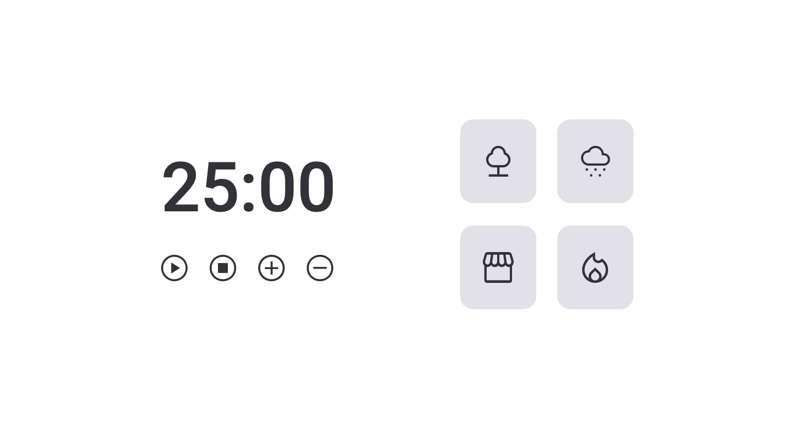

<h1 align="center"> Focus Timer Version 2.0 </h1>

  <a href="#-tecnologias">Technology</a>&nbsp;&nbsp;&nbsp;|&nbsp;&nbsp;&nbsp;
  <a href="#-projeto">Project</a>&nbsp;&nbsp;&nbsp;|&nbsp;&nbsp;&nbsp;
  <a href="#-layout">Layout</a>&nbsp;&nbsp;&nbsp;|&nbsp;&nbsp;&nbsp;
  <a href="#memo-licença">License</a>

 

<h2 align="center"> Design </h2>

  

## 🚀 Technology

This project was developed with the technologies below:

- HTML and CSS
- Git and Github
- JavaScript

## 💻 Project

This is a second version of a focus timer application that allows you to set a timer that counts down until it reaches 00:00. The application includes buttons for different sounds, such as the sounds of a forest, rain, coffee shop, and fireplace. 

The technologies used in this application are listed below:

- Imperative Programming
- Declarative Programming
- New DOM methods
- Function Recursion
- Factory Pattern 
- Audio Manipulation

  

## :memo: License

This project is above the MIT license.

## link

<a href="https://gustavozonta.github.io/focustimer-2.0/" target="_blank"> Focus Timer 2.0</a>

---

 Made  ♥  by Gustavo Zonta
